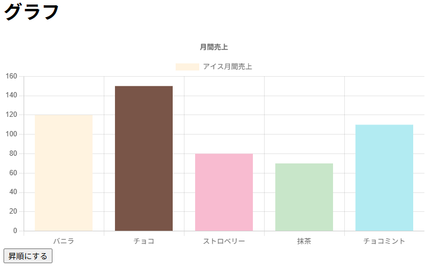

# 棒グラフ練習

dataはgeminiで生成しています
## 起動方法
docker compose up --build で立ち上げ  
(url)["http:localhost:5173"]  
## 実際の画面

## 工夫した点
ファイルに機能ごとに分割して、責務分離を行った  
引数にただstringと書くのではなく、受け取る文字列を指定してより安全に設計できるようにした  
初期はJSONの順番でグラフを表示して  
並び替えbuttonを置いてtoggleで昇順、降順の切り替えができるようにした  
fetch関数にジェネリクスを用いることで汎用的に、安全に使えるようにした

## 今回学んだこと
変にコードにハードコーディングして機能を増やすよりも、JSONの情報を増やしてinterfaceとして定義した方が拡張性が上がること  
これは今後のfastAPI学習にも活きてくると思った  

## 所感
棒グラフを今回実装したが、前回した円グラフとすることは本質的に変わらないことが分かった  
dockerでの環境構築、git のプルリクエスト、pullは慣れてきた気がする、今後も実践していきたい